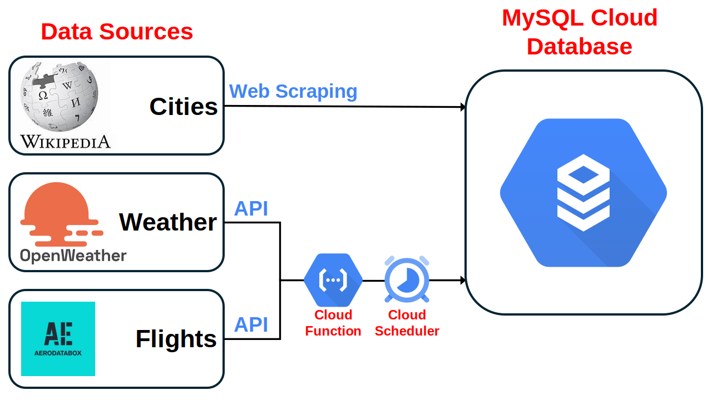
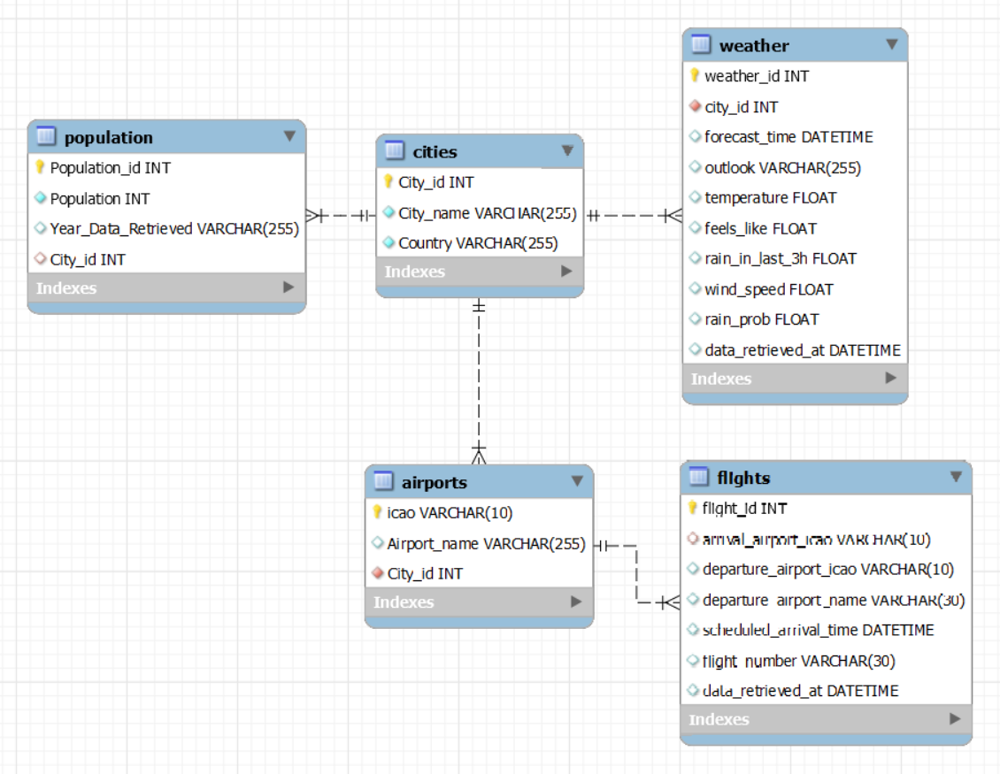

# Data-Engineering
# Gans E-Scooter Data Pipeline Project

## Project Objectives & Overview

### The Business Challenge

Gans, a growing e-scooter rental company, aims to establish its presence in major global cities by deploying hundreds of scooters available for rent by the minute. Despite gaining popularity through an eco-friendly marketing approach, their operational success hinges on the strategic placement of these scooters.

Optimal positioning would naturally balance scooter distribution through user movement between key points. However, several factors disrupt this balance:

- **Varied Elevation**: In cities with varied elevation, scooters are preferred for uphill travel, leading to uneven distribution.
- **Morning Commutes**: Morning routines typically involve traveling from residential areas to city centers.
- **Weather Conditions**: Rainfall significantly reduces e-scooter usage.
- **Tourist Arrivals**: The influx of tourists, particularly those arriving by plane, increases demand at airports and train stations.

As a Data Engineer at Gans, my role involved collecting external data to predict e-scooter movement patterns. This required daily, real-time data collection accessible company-wide, and the development and automation of a cloud-based data pipeline.

### Skills Utilized

- **Python (Pandas)**
- **Data Acquisition via Web Scraping (BeautifulSoup) and APIs**
- **Cloud Computing with Google Cloud Platform**
- **SQL Database Management (SQLAlchemy for Python-MySQL interaction)**

## Gathering Data

### Web Scraping for City Data

Using web scraping, I extracted city-related data from Wikipedia with BeautifulSoup. This approach allowed for the retrieval of structured data from HTML, which was then organized into dataframes. By leveraging Wikipedia's consistent URL structure across city pages, I created a function to automate data extraction. This method addressed Wikipedia's varied HTML structures for different cities, particularly for population data, by incorporating conditional logic to ensure continuity.

### API Integration for Weather and Flight Data

#### Weather Data via API

For weather forecasts, I utilized the OpenWeather API, specifically their 5-day forecast service. The API's JSON-formatted data facilitated easy manipulation and integration into our data model.

#### Flight Arrival Information

Flight data was sourced through AeroDataBox via Rapid API, a marketplace simplifying API usage. Functions were developed to fetch and structure this data into dataframes, focusing on acquiring next-day flight arrival times for operational planning.

### Project Phases

**Phase 1: Local Pipeline**

Initially, I created a local data pipeline that involved collecting data from external sources, transforming it, and storing it in a MySQL database. This provided a foundation for building a scalable and automated cloud-based pipeline.

**Phase 2: Cloud Pipeline**

After the local pipeline was operational, I migrated it to the Google Cloud Platform (GCP). GCP offers numerous advantages for data pipelines, including scalability, flexibility, automation, and maintenance.

## Data Storage

### Local Storage with MySQL

Following data collection, the resulting city, weather, and flight data were organized into dataframes and stored in a MySQL database for analysis.

## Google Cloud Platform Integration

Transitioning the local data pipeline to the cloud was a crucial step for enhancing Gans' operational efficiency by providing real-time insights into e-scooter demand influenced by weather changes and flight arrivals. The migration to Google Cloud Platform (GCP) involved setting up a scalable, cloud-based infrastructure for data storage and processing.

### Creating and Connecting to a SQL Instance

Initially, I established a MySQL database within GCP to serve as our central repository for storing weather, city, and flight data. This involved creating a relational database instance and configuring it for secure access.

### Serverless Computing with Google Cloud Functions

To modernize our data processing approach, I leveraged Google Cloud's serverless computing solution, specifically Google Cloud Functions. This Function as a Service (FaaS) model enabled the deployment of individual functions that execute in response to cloud events, such as HTTP requests or Cloud Scheduler triggers, without the need to manage server infrastructure.

### Automating Data Updates with Cloud Functions

A key component of our cloud-based solution was a set of Google Cloud Functions designed to update our database with the latest weather and flight information. These functions were triggered automatically, ensuring that our data remains current and reliable for operational decisions.

### Scheduling Tasks with Cloud Scheduler

To automate the execution of our data collection and processing tasks, I utilized GCP's Cloud Scheduler. This fully managed cron job service allowed us to schedule our Cloud Functions to run at predetermined intervals, ensuring that Gans always has access to the most recent data without manual intervention.

### Key Learnings and Deliverables

- **Data Collection: Web Scraping and APIs**
- **Data Storage: SQL Database**
- **Cloud Integration: GCP MySQL, Cloud Functions, and Cloud Scheduler**

## Conclusion

Working on this engineering project taught me several key skills. I learned how to gather information from the internet, including HTML pages like Wikipedia, and how to use APIs for dynamic data retrieval. I also developed the ability to store this data in the cloud, ensuring that the database remains operational and updated in real-time through automation. This project allowed me to apply my Python and MySQL skills in conjunction with cloud functions. Although I encountered numerous coding errors, I realized that errors are valuable learning opportunities rather than obstacles. Overall, this experience demonstrated the importance of resilience and continuous learning in engineering. 

<!-- Additionally, I wrote my first article explaining my journey in this new field of Data Engineering. You can read it here: [My First Project as a Data Engineer](https://medium.com/...).  -->
